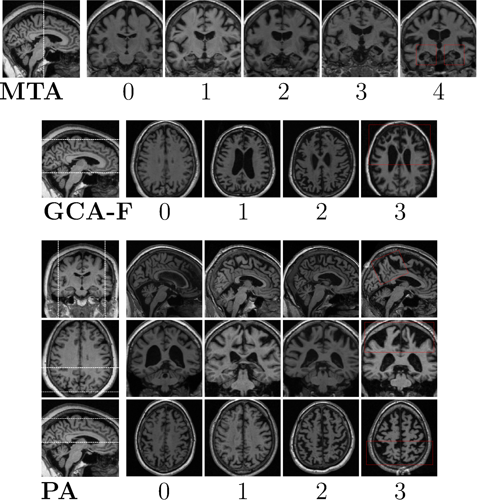
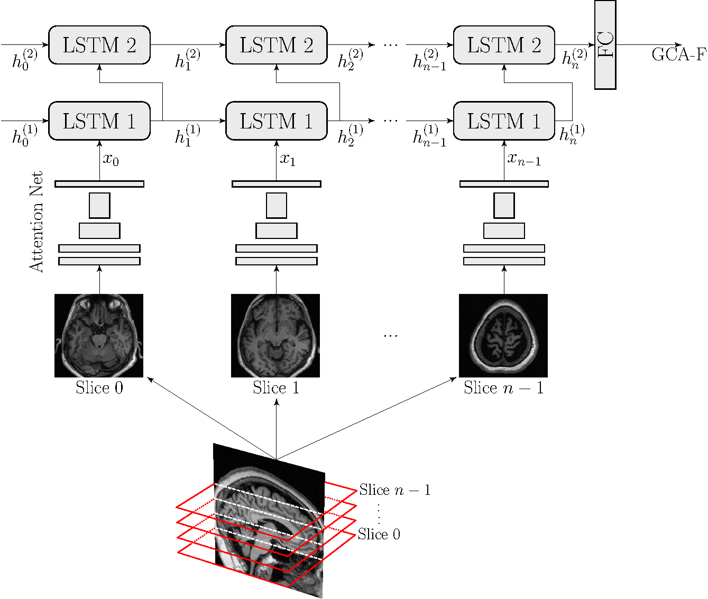

# AVRA - Automatic Visual Ratings of Atrophy
*Current version: 0.8.*

*AVRA* is a tool that takes an unprocessed T1-weighted MRI image (in .nii or .nii.gz format) of the brain and automatically predicts Scheltens' scale of medial temporal atrophy (MTA), Pasquier's frontal subscale of global cortical atrophy (GCA-F), and Koedam's scale of Posterior Atrophy (PA). These scales are used clinically to visually quantify the degree of atrophy and is an important clinical biomarker in neurodegenerative disorders such as Alzheimer's Disease. AVRA was trained on more than 2000 images with visual ratings made by an expert neuroradiologist.

The methods in this repository is described in:

Gustav Mårtensson, Daniel Ferreira, Lena Cavallin, J-Sebastian Muehlboeck, Lars-Olof Wahlund, Chunliang Wang, and Eric Westman, [AVRA: Automatic Visual Ratings of Atrophy from MRI images using Recurrent Convolutional Neural Networks.](https://www.sciencedirect.com/science/article/pii/S2213158219302220), NeuroImage: Clinical, 2019.

The R-CNN is based on the Residual Attention Network from [Wang et al. (2017)](https://arxiv.org/abs/1704.06904).




<em>Figure: Example images of the visual rating scales that AVRA predicts (left) and illustration of the network architecture used (right). Images from https://www.sciencedirect.com/science/article/pii/S2213158219302220 </em>


**Please note that AVRA has not been extensively validated across different protocols, scanners or populations and should be used for research purposes only.** 
## Table of  contents

* [Getting Started](#getting-started)
   * [Prerequisites](#prerequisites)
   * [Installing](#installation)
   * [Download model weights](#download--model-weights)
* [Usage](#usage)
   * [Single case](#single-case)
   * [Multiple files](#multiple-files)
* [Troubleshooting](#troubleshooting)
* [Citation](#cite)
* [License](#license)
* [Contact](#contact)

## Getting Started

These instructions show you code prerequisites needed to run AVRA and how to install them. Please note that to use AVRA you need a unix-based OS (i.e. Linux or macOS) or running a Linux Virtual machine. 

### Prerequisites

**Prerequisites**
- To run `avra.py` you need to have the following installed:
  - Python 3.5 or higher, with the following packages:
    - numpy
    - matplotlib
    - argparse
    - glob
    - csv
    - nibabel
    - h5py
    - nipype
  - [PyTorch 1.2](pytorch.org) or higher.
  - [FSL v6.0](https://fsl.fmrib.ox.ac.uk/fsl/fslwiki/)

See below for installation instructions.

### Installation

**Download AVRA python scripts**
- Open a terminal and cd to the folder where you wish to install avra and clone repository:
``` 
cd /path/to/your/installation/folder && git clone https://github.com/gsmartensson/avra_public.git
``` 

or press "Clone or Download" in the top right corner and unzip the repository in your folder of choice.

**Install requirements**
- Install latest FSL version (currently v6.0) by following the instructions [here](https://fsl.fmrib.ox.ac.uk/fsl/fslwiki/FslInstallation). FSL is needed for the automatic AC/PC alignment used in AVRA, and called from the nibabel library. Make sure that the FSLDIR environment variable is set (run `echo $FSLDIR` in the terminal which should display the directory FSL was installed in).

We suggest that you install all python libraries in a conda environment, see instructions [here](https://conda.io/projects/conda/en/latest/user-guide/install/index.html?#). This is not necessary in order to use AVRA, however.

- Install required python libraries (except for PyTorch) by executing the following (inside the avra_public folder):
``` 
pip install -r requirements.txt
```
- Install the latest PyTorch version (currently 1.2) by following the instructions [here](https://pytorch.org/). PyTorch is a deep learning platform with a Python front-end.

### Download model weights
In order to use AVRA you also need to download the pretrained model weights to your computer. 

In the terminal:

```
cd /path/to/model-dir
wget "https://github.com/gsmartensson/avra_public/releases/download/0.8/0.8.tar.gz"
tar -xvf 0.8.tar.gz 
```
or, if you don't want to use the terminal, copy the link into your browser. This will prompt a download, which you direct to you directory of choice. Left-click on the .tar.gz and extract content.

To download the model weights used in the [original paper](https://www.sciencedirect.com/science/article/pii/S2213158219302220) (v0.7, trained on a smaller data set), use the link "https://github.com/gsmartensson/avra_public/releases/download/0.7/0.7.tar.gz" instead.

## Usage
### Single case
To process an image through AVRA you can use the following command (inside the folder `avra_public`):
```
python avra.py --input-file /path/to/image_folder/input_filename.nii.gz --model-dir /path/to/model_weights_folder --uid new_output_filename_prefix --output-dir /path/to/output_folder
```

This command would input the image `input_filename.nii.gz`, load the pretrained weights located in `/path/to/model_weights_folder/mta/model_*.pth.tar` and produce the files:

- `new_output_filename_prefix.csv`: csv file with all predicted visual ratings from AVRA. E.g. the column `mta_left_mean` is the mean of the prediction from the ensemble models and is the value that we have used in our [paper](https://www.sciencedirect.com/science/article/pii/S2213158219302220) (https://www.sciencedirect.com/science/article/pii/S2213158219302220). Other columns s.a. `mta_left_model_3` refers to the prediction of the third ensemble model, and `mta_left_std` the standard deviations of the ensemble predicitons.
- `new_output_filename_prefix_coronal.jpg`: coronal slice of `input_filename.nii.gz`, close to MTA rating slice. This image is used for debugging purposes. If the FSL registration (AC-PC alignment) fails severely, the jpg image while typically not show a coronal slice.
- `new_output_filename_prefix_mni_dof_6.nii`: AC-PC aligned .nii of `input_filename.nii.gz`.
- `new_output_filename_prefix_mni_dof_6.mat`: Computed transformation matrix for the AC-PC alignment from FSL. Since the FLS registration is the most time consuming step of `avra.py`, saving the intermediate processing step can save time if you want to re-run AVRA with e.g. new trained weights in future.

If `--uid` is not provided, the output file prefix will instead be the basename of the input-file.

### Multiple files
To process all .nii images in one folder, you can e.g. execute the following command in your terminal:
```
for f in /path/to/images/*.nii; do python avra.py --input-file $f --output-dir /path/to/output/folder --model-dir /path/to/model/weights; done
```
This will process all .nii or .nii.gz images in the folder /path/to/images/img1.nii with the output files img1.csv, img1_coronal.jpg, etc being saved in the specified output-folder. All images will have their own .csv file with it's associated ratings. To merge all .csv files in your output directory into a single .csv file you can run

```
awk '(NR == 1) || (FNR > 1)' /path/to/output/folder/*.csv > merged_file.csv

```

## Troubleshooting

- Occasionally the FSL registration fails (<1% in our experience), causing the predictions from AVRA to be useless. There is currently no tool implemented to catch when this happens. The easiest way to screen for this is to browse through the .jpg:s for images that does not show a coronal image.

- To run FSL:s installer script python 2.x  is required, which is not included in newer versions of Ubuntu for instance. If you don't have it installed you can
```
conda create --name py2 python=2.7
conda activate py2
```
and the run `python2.7 fslinstaller.py`.

- Please report any problems with running AVRA on https://github.com/gsmartensson/avra_public/issues

## Citation
If you use AVRA in your research, please cite:
> Gustav Mårtensson, Daniel Ferreira, Lena Cavallin, J-Sebastian Muehlboeck, Lars-Olof Wahlund, Chunliang Wang, and Eric Westman, [AVRA: Automatic Visual Ratings of Atrophy from MRI images using Recurrent Convolutional Neural Networks.](https://www.sciencedirect.com/science/article/pii/S2213158219302220), NeuroImage: Clinical, 2019.

## License

The code in this project is licensed under the MIT License - see [LICENSE.md](LICENSE.md) for details.

Please note that AVRA relies on third-party software with other licesenses:
- FSL - see [FSL license](https://fsl.fmrib.ox.ac.uk/fsl/fslwiki/Licence) for details.
- nipype - see [license](https://github.com/nipy/nipype/blob/master/LICENSE) for details.
- nibabel - see [license](http://nipy.org/nibabel/legal.html) for details.

## Contact
gustav.martensson@ki.se
